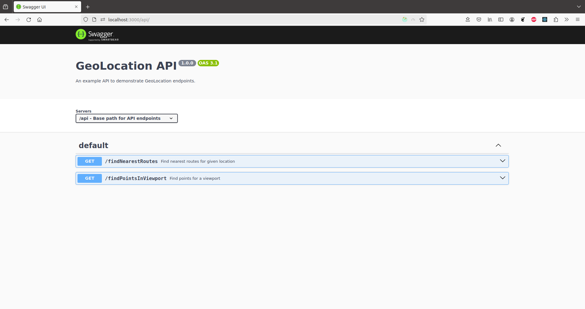

# Geo Location

This project is a small geo location application.

It consists of a small React frontend and a small Express backend. 

The frontend displays an interactive map. 
It renders points within the viewport and highlights points belonging to the closest route in red when you click on a location.

The backend provides geo location endpoints to find routes closest to a given location and to find points within a given viewport. 

## Usage

In [frontend](frontend/) you have detailed instructions for running the application frontend. 
In [backend](backend/) you have detailed instructions for running the application backend. 

If you decide to use docker, after building the images, you can run both frontend and backend using docker-compose:
`sudo docker-compose up`

### Quick local guide

1. Clone the repository
2. Frontend
   - `cd frontend/`
   - `npm install`
   - `npm start`
3. Backend
   - `cd ../backend/`
   - `npm install`
   - `node index.js`

### Quick docker guide

1. Clone the repository
2. Frontend
   - `cd frontend/`
   - `dockerize.sh`
3. Backend
   - `cd ../backend/`
   - `dockerize.sh`
4. Run at once:
   - `cd ..`
   - `sudo docker-compose up`

## Contributors

Petar Afrić

## Showcase

